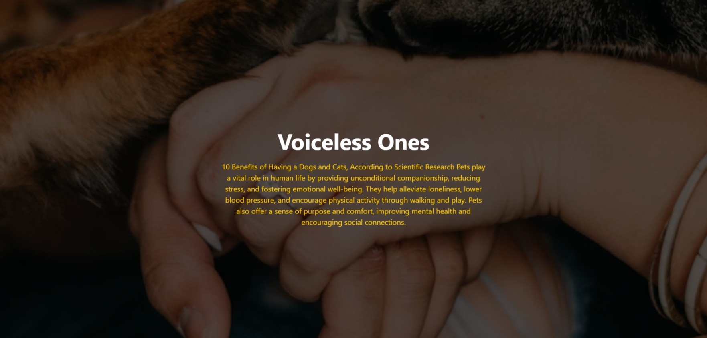

# 🐾 Voiceless Ones — Landing Page

A modern, minimal landing page built using **Tailwind CSS** that highlights the emotional and scientific benefits of having pets like dogs and cats. The design uses blend effects and a strong visual hierarchy to create an impactful user experience.

---

## 📌 Overview

**Voiceless Ones** is a simple yet visually engaging webpage focused on spreading awareness about the importance of pets in human life. It combines:

* A full-screen background image
* Overlay blend effects for mood and contrast
* Centered content with strong typography
* Responsive design using Tailwind CSS

---

## 🚀 Features

* 🎨 **Modern UI Design**

  * Clean typography and centered layout
  * Subtle overlay effect using `mix-blend-overlay`

* 📱 **Responsive Layout**

  * Optimized for mobile, tablet, and desktop screens

* ⚡ **Lightweight**

  * No build tools required
  * Uses Tailwind via CDN

* 🖼️ **Dynamic Visual Appeal**

  * Fullscreen background image with blending

---

## 🛠️ Tech Stack

* **HTML5**
* **Tailwind CSS (CDN)**

---

## 📂 Project Structure

```
project/
│
├── index.html
└── README.md
```

---

## 💻 Getting Started

1. Clone or download the project
2. Open `index.html` in your browser

No installation or dependencies required.

---

## 📸 Preview

* Full-screen hero section
* Background image with overlay blend
* Centered title and descriptive text



---

## ✨ Customization

You can easily modify:

* **Text Content**

  * Update the heading and paragraph in the HTML

* **Background Image**

  * Replace the Unsplash URL with your own image

* **Colors**

  * Change Tailwind classes like:

    * `bg-stone-800`
    * `text-yellow-400`
    * `text-white`

---

## 📖 Purpose

This project demonstrates:

* Use of Tailwind utility classes
* Creating visually rich hero sections
* Applying `mix-blend` effects for design enhancement

---

## 📜 License

This project is open-source and free to use for learning and personal projects.